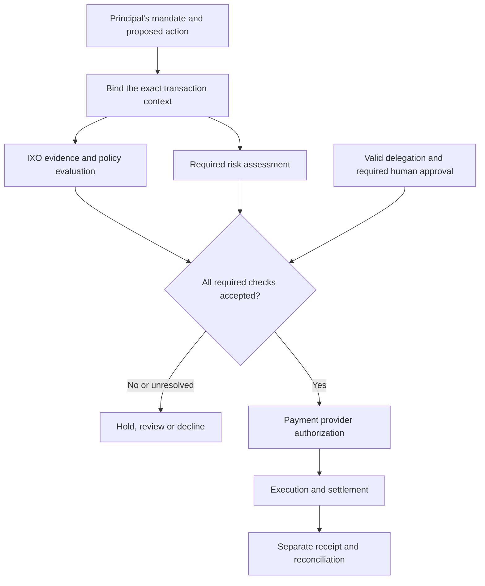

# The payments ecosystem

IXO Decisions belongs before a consequential payment action, where a workflow needs to establish whether the proposed action meets its evidence and policy conditions. The surrounding ecosystem supplies identity, delegation, risk assessment, payment authorization and settlement.

These functions can share information and overlap. A deployment must assign an owner to each required check rather than assume that a component's name guarantees coverage.

## Who does what

| Participant or function | Responsibility | Relationship to IXO |
| --- | --- | --- |
| Principal and agent platform | Define intent, identify the agent and constrain what it may request. | Supply the request and authority context. |
| Commerce service | Establish the offer, cart, price and fulfillment terms. | Supply the exact object to evaluate. |
| IXO Decisions | Evaluate the subject under an accepted policy and record the determination. | Supply evidence of the decision. |
| Risk and underwriting provider | Apply its risk policy to the transaction and counterparties. | Exchange relevant evidence and assessment references under an agreed contract. |
| Account controller and payment provider | Validate spending authority and apply their payment controls. | Accept or reject the decision as one required input. |
| Payment rail and settlement participants | Execute value movement and report its result. | Produce a separate transaction or settlement record. |
| Operator and reviewer | Reconcile records, investigate exceptions and handle challenges. | Use the evidence and decision history. |

Trustline is one potential risk and underwriting provider. Its documented scope also includes policy and evidence evaluation. The [Trustline page](05-trustline.md) addresses that overlap directly.

## A proposed transaction flow

This is a logical responsibility map. Some workflows obtain risk screening first. Others need an IXO determination before underwriting can finish. A partner integration must define that order and prevent circular requests.

## One payment, distinct records

A complete record links the principal's mandate, the evaluated offer, the decision, any required risk assessment, payment authorization and the provider's execution result. Each record retains its own issuer and meaning.

An accepted decision establishes the evaluator's assertion. A payment authorization establishes permission in the payment system. A receipt reports the result of execution. A merchant's fulfillment evidence reports delivery. None of these records establishes all the others.

For x402, the current UDID proposal carries the decision through an extension while preserving base payment messages. The repository's reference facilitator verifies supported credentials and authorizations before invoking its configured payment adapter. This is a reference implementation, not evidence that all x402 facilitators accept UDID. See [the reference application](../../apps/facilitator/README.md).

For card, bank and mobile-money workflows, the proposed pattern is to connect the accepted determination to the provider's own transaction reference. Access, supported fields and operating responsibilities require a provider-specific integration.

## Handle failure without creating a second payment

If evaluation or underwriting is unresolved, the workflow holds the action. A timeout is not approval. If payment submission has an unknown outcome, the operator reconciles the original request before creating another transfer.

The payment process needs its own idempotency and replay controls. An idempotent request to a decision service prevents repeated assessment requests; it does not by itself prevent duplicate settlement.

Decision correction, refund and reversal are separate operations. The authorized party must use the payment provider's supported process to return funds. A corrected credential alone cannot reverse a transfer.

Next: [IXO and Trustline](05-trustline.md).
